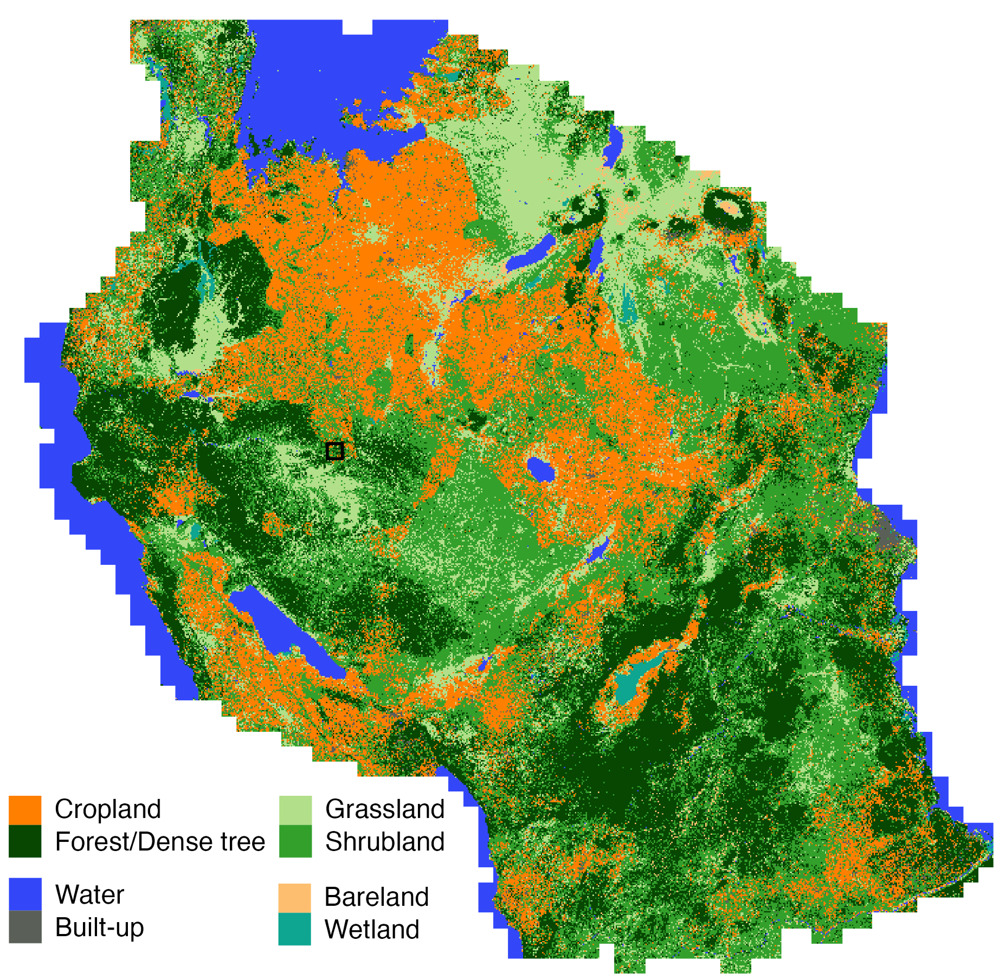

### All code and scripts are host on [**GitHub**](https://github.com/LLeiSong).

## Package
### [itsdm](https://github.com/LLeiSong/itsdm)

<!-- badges: start -->
[](https://www.repostatus.org/#active)
[](https://github.com/LLeiSong/itsdm/actions)
[](https://CRAN.R-project.org/package=itsdm)
<!-- badges: end -->

`itsdm` calls isolation forest and variations such as SCiForest and EIF to model species distribution. It provides features including:

- A few functions to download environmental variables.
- Outlier tree-based suspicious environmental outliers detection.
- Isolation forest-based environmental suitability modeling.
- Non-spatial response curves of environmental variables.
- Spatial response maps of environmental variables.
- Variable importance analysis.
- Presence-only model evaluation.
- Method to convert predicted suitability to presence-absence map.
- Variable contribution analysis for the target observations.
- Method to analyze the spatial impacts of changing environment.

<p align="left"> </p>

To install the latest release on CRAN:

```r
install.packages("itsdm")
```

The latest [development version](https://github.com/LLeiSong/itsdm) on GitHub can be installed with:

```r
# install.packages("remotes")
remotes::install_github("LLeiSong/itsdm")
```

### [hrlcm](https://github.com/LLeiSong/hrlcm)

[](https://www.repostatus.org/#active)

This is a package that combines R and Python to do land cover mapping. There are three main parts of scripts for this project:

- data_preprocess: this directory includes all scripts to download and preprocess satellite images.
- guess_model: this directory includes all scripts to build gap-filling Random Forest model and generate ensemble labels.
- hrlcm: this directory includes all scripts to build U-Net model to do land cover mapping.

and other useful scripts and resources:

- tools: other useful scripts for post-mapping processing or use AWS cloud computing.
- docs: useful tutorials or posters/presentations for conference.

<p align="left"> </p>

To install the hrlcm modeling python package:

```r
git clone git@github.com:LLeiSong/hrlcm.git
cd hrlcm
pip install .
```

### [sentinelPot](https://github.com/LLeiSong/sentinelPot)

[](https://www.repostatus.org/#active)

This package is a package to wrap necessary steps to preprocess sentinel-1&2 images. 
Full credit should be given to the authors of these preprocessing methods. 

Check its [GitHub](https://github.com/LLeiSong/sentinelPot) page for more details of how to use it. **Note** that some functions may be outdated due to the rapid development of image processing.

**Sentinel-1**

Level-2 process (Use command line graph processing framework in SNAP software):

1. Apply orbit file.
2. Thermal noise removal.
3. Border noise removal.
4. Calibration.
5. Speckle filtering.
6. Range doppler terrain correction.
7. Conversion to dB.

Level-3 process:

1. Apply guided filter to remove speckle noises further.
2. Fit harmonic regression coefficients using Lasso algorithm.
    
**Sentinel-2**

Level-2 process:

Basically level-2 means atmospheric correction and cloud/shadow detection. We include three basic methods: 
sen2cor on SNAP software for atmospheric correction, Fmask for cloud/shadow detection, and MAJA installed on peps server for both. 
You could find more details here: [sen2cor](https://step.esa.int/main/snap-supported-plugins/sen2cor/), [Fmask](https://github.com/GERSL/Fmask) and [peps MAJA](https://github.com/olivierhagolle/maja_peps).
Here, we combined sen2cor and Fmask together as a regular way for level-2 process, and a MAJA way as a second method. 

Level-3 process:

Run docker to process WASP to get seasonal syntheses of sentinel-2 imagery. The details are here: [WASP](https://github.com/LLeiSong/waspire).

<p align="left"> </p>

To install:

NOTE: You might want to edit `requirements.txt` before installation if you don't want to change the existing packages on your own machine.

```r
git clone git@github.com:LLeiSong/sentinelPot.git
cd sentinelPot
pip install .
```

## Other code

### [waspire](https://github.com/LLeiSong/waspire)

Docker to run Orchestrate WASP (Weighted Average Synthesis Processor) to create monthly syntheses of cloud-free reflectance for sentinel-2 or Venus Level-2A products distributed by the [Theia Land data centre](https://theia.cnes.fr/atdistrib/rocket/#/home).

To install:

1. [Download WASP binary zifile](https://logiciels.cnes.fr/en/license/128/515), unzip and copy it into the root of this repository.

2. From the root of this repository in terminal, run
   ```r
   docker build -t wasp .
   ```

## Dataset

Land cover map of Tanzania (4.77 m) and the training set: [**OSF**](https://osf.io/4qj36/).

<p align="left"> </p>
